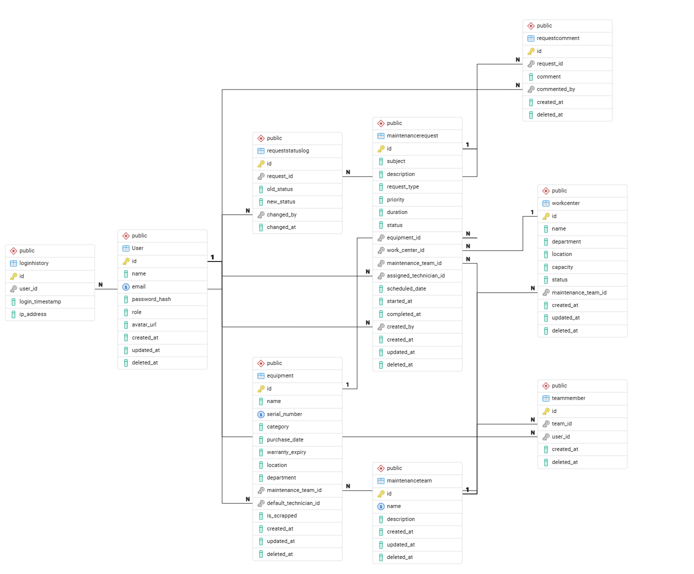
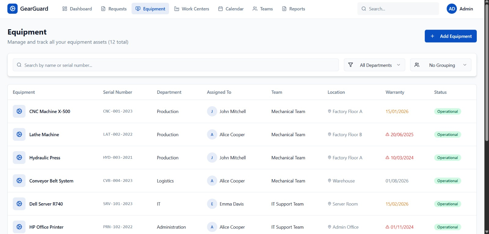
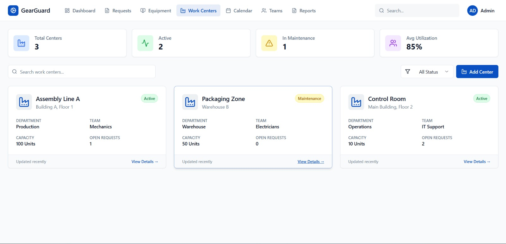
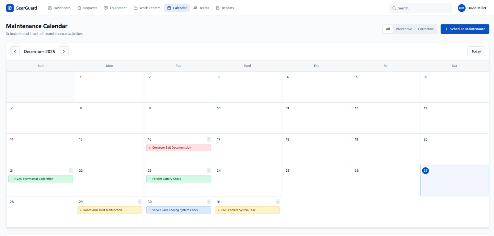

# GearGuard – Maintenance Management System

GearGuard is a Maintenance Management System designed to help organizations track equipment, manage maintenance teams, and handle corrective and preventive maintenance requests through a structured workflow.

This project was built as part of an **Odoo Hackathon**, with a strong focus on:

* clean database design (3NF)
* real-world ERP workflows
* role-based access control
* scalable and maintainable architecture

---

##  Core Features

### Equipment Management

* Central registry of company assets
* Each equipment is linked to a default maintenance team
* Scrap logic to mark unusable equipment

### Maintenance Requests

* Corrective and Preventive requests
* Workflow: `New → In Progress → Repaired / Scrap`
* Auto-inheritance of maintenance team from equipment
* Technician assignment and tracking

### Preventive Maintenance

* Scheduled maintenance using calendar view
* Preventive requests appear on the calendar using `scheduled_date`

### Role-Based Access

* **Admin / Manager**: full control (equipment, teams, requests)
* **Technician**: work on assigned requests
* **Employee**: create and track own requests

### Audit & Tracking

* Request status change history
* Soft deletes across all entities

---

##  Tech Stack

* **Frontend**: React (Dashboard, List, Kanban, Calendar views)
* **Backend**: Python (API + business logic)
* **Database**: PostgreSQL
* **Version Control**: Git
* **Database Collaboration**: Shared SQL schema + seed data

---

##  Database Design

* Fully normalized to **Third Normal Form (3NF)**
* No denormalized or duplicated data
* Explicit junction tables for many-to-many relationships
* All deletes handled via `deleted_at` (soft delete)

### Core Tables

* `User`
* `MaintenanceTeam`
* `TeamMember`
* `Equipment`
* `MaintenanceRequest`
* `RequestStatusLog`
* `RequestComment` (optional)

The database schema is defined in `database/schema.sql`.

---

##  Database Setup (Local)

### Prerequisites

* PostgreSQL installed
* `psql` available in PATH

### Steps

```bash
# Create database
createdb gearguard_db

# Apply schema
psql gearguard_db < database/schema.sql

# Load seed data
psql gearguard_db < database/seed.sql
```

After this, all team members will have:

* identical tables
* identical demo data
* no schema conflicts

---

##  Team Collaboration Rules (Important)

* One DB owner maintains `schema.sql`
* No one modifies tables manually
* All schema changes go through Git
* Frontend and backend must align strictly with schema fields

This ensures consistent development across the team.

---

##  Maintenance Request Workflow

1. Employee creates a maintenance request
2. Equipment is selected
3. System auto-assigns maintenance team from equipment
4. Request starts in `New`
5. Technician assigns themselves
6. Status moves to `In Progress`
7. On completion, status moves to `Repaired`
8. Scrap requests mark equipment as unusable

---

##  Frontend Views

* **Dashboard**: overview of requests and statuses
* **Requests**: list + status tracking
* **Kanban Board**: workflow management by status
* **Calendar**: preventive maintenance scheduling
* **Equipment**: asset management
* **Teams**: team and technician management

All frontend data is dynamically loaded from the database.

---

##  Seed Data

Seed data includes:

* sample users (admin, manager, technicians, employee)
* maintenance teams
* equipment
* sample maintenance requests

This allows immediate testing and demo without manual setup.

---

## ER Diagram



## UI





